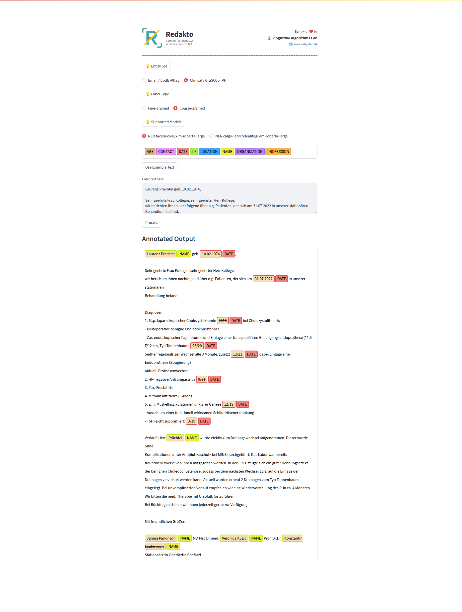
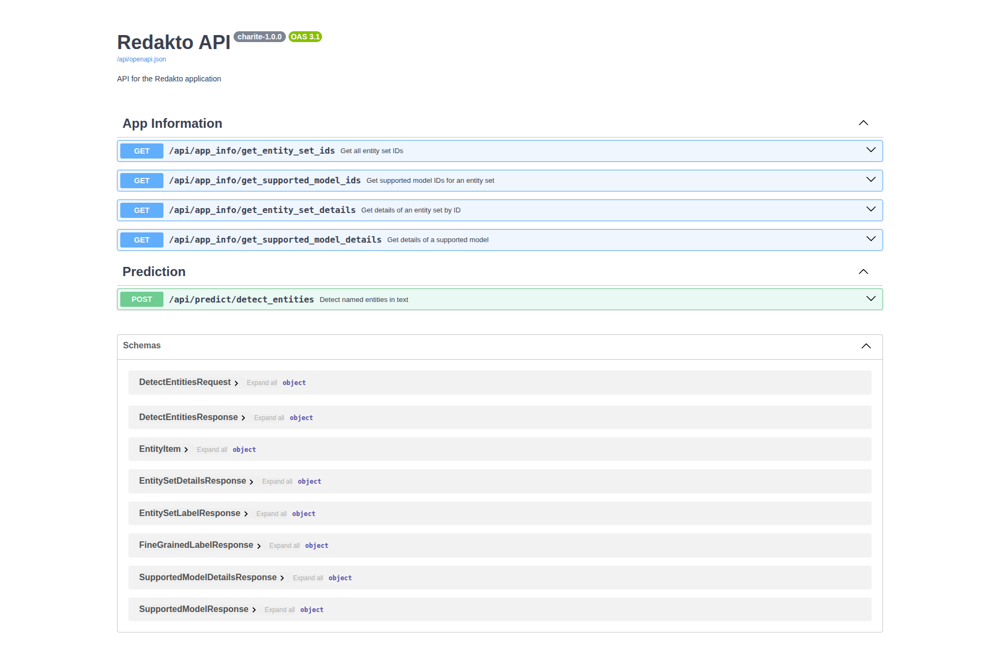

# redakto-app-charite

This repository contains the code for the Redakto application developed for Charité. Redakto is designed to facilitate redaction of private and sensitive information from textual data, ensuring compliance with data protection regulations.

## GitHub Repository
https://github.com/calgo-lab/redakto-app-charite

## Docker Hub Repository
https://hub.docker.com/r/sksdotsauravs/redakto-app-charite

## How to run the dockerized application
1. Ensure you have Docker installed on your machine.
2. Pull the Docker image from Docker Hub using the following command:
   ```
   docker pull sksdotsauravs/redakto-app-charite:latest
   ```
3. Run the Docker container with the following commands:

   (a) Without GPU support:
   ```
   docker run -p 8000:8000 -p 8501:8501 sksdotsauravs/redakto-app-charite:latest
   ```
   (b) With GPU support:
   ```
   docker run --gpus "device=0" -p 8000:8000 -p 8501:8501 sksdotsauravs/redakto-app-charite:latest
   ```
4. Access the application UI built with Streamlit by navigating to http://localhost:8501 in your web browser.

5. The documentation for the backend API built with FastAPI can be accessed at 
    
    (a) http://localhost:8000/api/docs or at 

    (b) http://localhost:8000/api/redoc or at 

    (c) http://localhost:8000/api/openapi.json

<br>

## UI Preview


## FastAPI Documentation Preview
